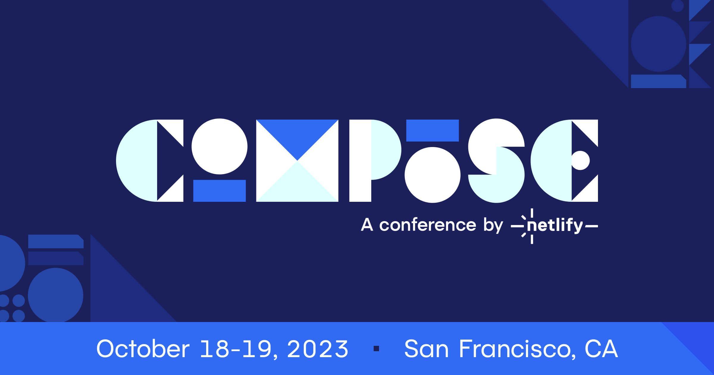
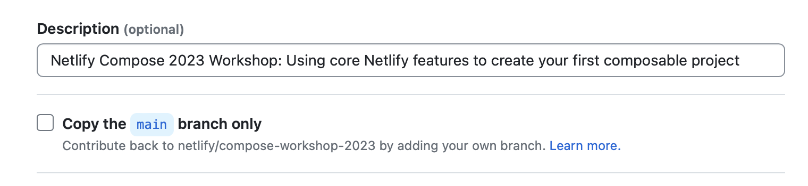
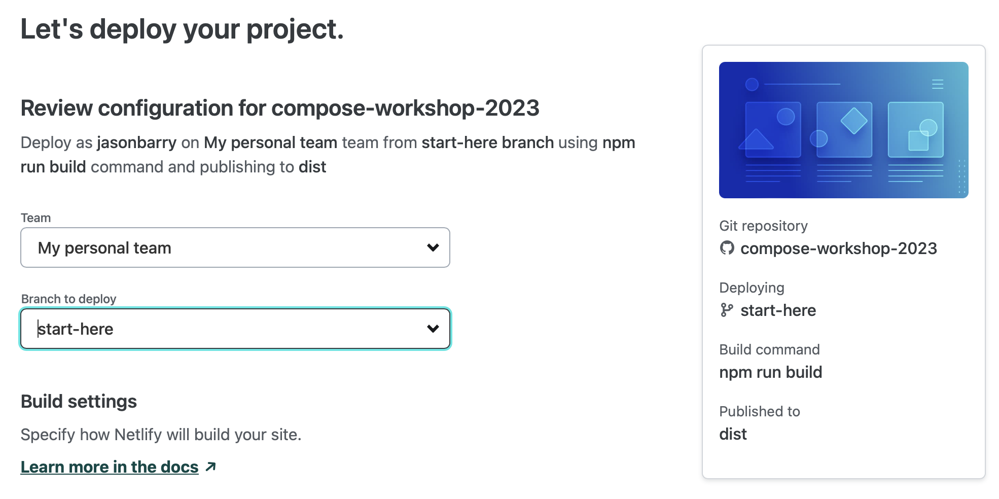
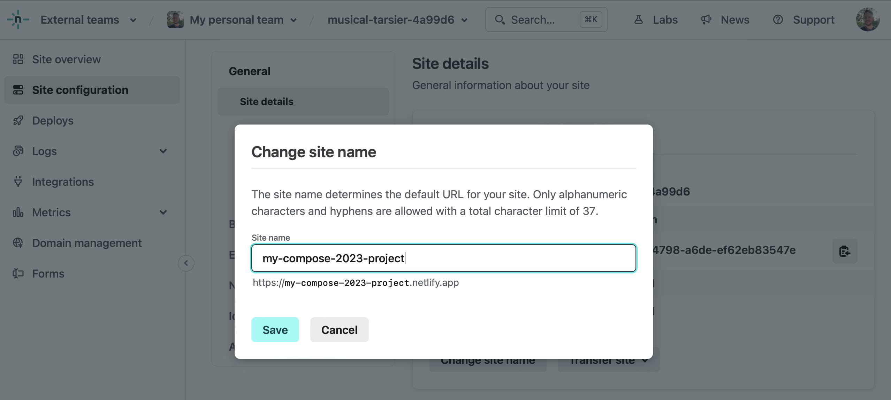
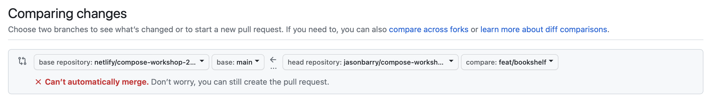
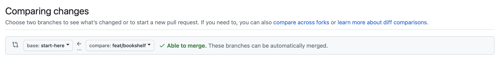
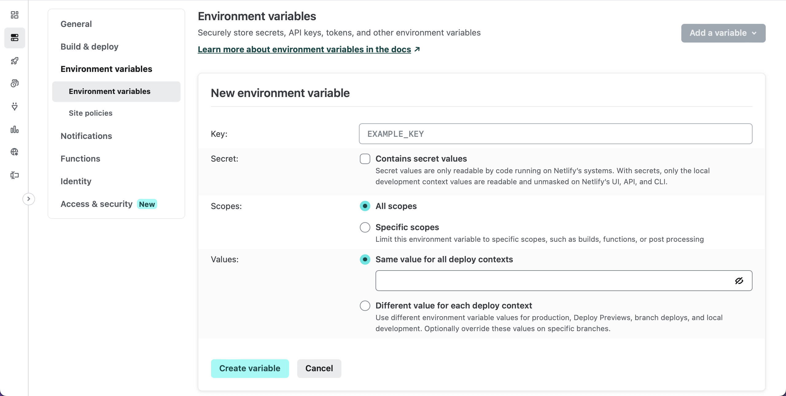

# Netlify Compose 2023 Workshop

Welcome to Compose! In this workshop, you will learn how to create your first composable website with Netlify.



## What are we going to build?

In two and a half hours, we are going to build a Halloween-themed e-commerce bookstore. The frontend stack will be composed of React, TypeScript, Vite, and Tailwind, and served from Netlify's global high-performance edge network. It will fetch data sources from Contentstack and Storyblok  using [Netlify Connect](https://www.netlify.com/products/connect/). We will build a custom data connector using the [Netlify SDK](https://sdk.netlify.com/connectors/overview/) that reads data from an Amazon S3 bucket. Finally, the site will reach out to third-party services including Stripe and OpenAI using Netlify Functions. The future is composable! 

An example of the finished product is available here: [https://compose-workshop-2023.netlify.app](https://compose-workshop-2023.netlify.app)

## What are we going to learn?

In this workshop, you will learn how to:

- Create your first site on Netlify
- Trigger builds with Git and embrace a CI/CD workflow
- Create Deploy Previews and collaborate using the Netlify Drawer
- Manage environment variables securely in the Netlify CLI and Netlify UI
- Stream API responses from OpenAI using Netlify Functions
- Personalize user experiences with Netlify Edge Functions
- Persist cache from API responses using fine-grain cache control
- Fetch content from Contentstack and Storyblok using Netlify Connect
- Build a custom connector using the Netlify SDK to pull data from Amazon S3


## Let's get started

<details><summary>Step 0. Initial setup</summary>

i. [Fork this repo](https://github.com/netlify/compose-workshop-2023/fork) into your personal account, and uncheck the `Copy the main branch only` checkbox, so that you copy all branches and not just `main`



ii. Install the [Netlify GitHub app](https://github.com/apps/netlify/installations/select_target) on your org or repo if you have not done so already

iii. Clone your fork, and checkout the `start-here` branch

```bash
git clone <FORK_URL>
git checkout start-here
```

iv. Install dependencies locally

```bash
npm i
```

v. Ensure you have the latest version of `netlify-cli` installed globally

```bash
npm i netlify-cli -g
netlify --version
```

💡 Learn more about the [Netlify CLI](https://docs.netlify.com/cli/get-started/) in our docs.

</details>

<details><summary>Step 1. Create a new site and run local dev server </summary>

i. [Create a new site](https://app.netlify.com/start) by going to **Team overview > Add new site > Import an existing project**. Click the Deploy with GitHub button. After you authenticate, search for your fork. For the `Branch to deploy` field, be sure to select `start-here` as your default production branch. You can keep the auto-populated values for all other fields. Click the Deploy button to deploy your site. 



ii. Rename site to something more memorable in **Site configuration > Site details > Change site name**.



iii. Log in to the CLI, link your repo to your site, and start local dev server

```bash
netlify login
netlify link
netlify dev
```

💡 Learn more about [getting started](https://docs.netlify.com/get-started/) in our docs.

</details>

<details><summary>Step 2. Function primitives</summary>

Our site is looking a little bare. Let's add some content! First we'll fetch a list of books that we happen to have as a [CSV file saved inside the /public directory](https://github.com/netlify/compose-workshop-2023/blob/main/public/books.csv).

i. Add the `Bookshelf` component to `src/pages/index.tsx`

```diff
+import Bookshelf from '~/components/Bookshelf';
import Footer from '~/components/Footer';
import Hero from '~/components/Hero';

export default function Home() {
  return (
    <section>
      <Hero />
+     <Bookshelf />
      <Footer />
    </section>
  );
}
```

ii. Return data from a CSV in an API response in `netlify/functions/books.ts`

```typescript
import csv from 'csvtojson';

export default async (req: Request) => {
  const { origin } = new URL(req.url);
  const response = await fetch(`${origin}/books.csv`);
  const csvContent = await response.text();
  const books = await csv().fromString(csvContent);
  
  return Response.json(books);
};
```

💡 Invoke your function from the CLI:

```
netlify functions:invoke books
```

iii. Fetch from the function in `src/context/DataProvider.tsx`

```diff
function StoreProvider({ children }: Props) {
- const books = [] as Book[];
+ const [books, setBooks] = useState<Book[]>([]);

  const fetchBooks = async () => {
+   if (!books.length) {
+     const response = await fetch(`/.netlify/functions/books`);
+     const data = await response.json();
+     setBooks(data);
+   }
  };
}
```

That's nice, but we can only return all the books, when sometimes we only want one book at a time. Let's add a custom path with an optional slug in the API route.

iv. Export custom config to control method, route, etc in `netlify/functions/books.ts`

```typescript
export const config: Config = {
  method: 'GET',
  path: '/api/books{/:id}?',
};
```

💡 The `path` parameter follows the [URL Pattern API](https://developer.mozilla.org/en-US/docs/Web/API/URL_Pattern_API) spec.


v. Change your clientside API call to new route in `src/context/DataProvider.tsx`

```diff
-  const fetchBooks = async () => {
-   if (!books.length) {
-     const response = await fetch(`/.netlify/functions/books`);
-     const data = await response.json();
-     setBooks(data);
-   }
-  };
+  const fetchBooks = async (id: string = '') => {
+    if (books.length <= 1) {
+      const response = await fetch(`/api/books/${id}`);
+      const data = await response.json();
+      setBooks(Array.isArray(data) ? data : [data]);
+    }
+  };
```

vi. Extract and log the id from the URL params in `netlify/functions/books.ts`

```diff
-export default async (req: Request) => {
+export default async (req: Request, context: Context) => {
+  const { id } = context.params;
+  console.log(`Looking up ${id || 'all books'}...`);
```

vii. Return a single book if the slug is present before the last return statement

```typescript
if (id) {
  const book = books.find(b => b.id === id);
  if (!book) {
    return new Response('Not found', { status: 404 });
  }
  return Response.json(book);
}
```

💡 Learn more about [Functions](https://docs.netlify.com/functions/overview/) in our docs.

</details>

<details><summary>Step 3. Branches, CI/CD, and Deploy Previews</summary>

Create a new branch, commit changes, push the branch, and open a pull request *against the `start-here` branch of your own repo.*

```bash
git checkout -b feat/bookshelf
git add -A
git commit -m "Adding a list of books to the home page"
git push origin feat/bookshelf
```

Since you're working in a fork, be sure to change the base repo and branch: 

Before: 


After: 


You should see a link to the Deploy Preview as a comment by the Netlify bot on the pull request. Pushing to an open pull request [will kick off a new build](https://www.netlify.com/products/build/) in the Continuous Integration pipeline, and you can inspect the deploy logs as the build is building and deploying.

In addition to deploy logs, the Netlify UI gives you access to function logs as well. You can change the region a function executes by changing the region selector in **Site configuration > Build & deploy > Functions**.

In the Deploy Preview itself, you'll notice a floating toolbar anchored to the bottom of your screen. This is the [Netlify Drawer](https://www.netlify.com/products/deploy-previews/). You and your teammates can use this to leave feedback to each other about the Deploy Preview. Any comments you make will sync back to the pull request on GitHub (or any Git service that you may use). 

Back in the pull request, merge to main. This will kick off a production build. Every deploy is [atomic](https://jamstack.org/glossary/atomic/) and [immutable](https://jamstack.org/glossary/immutable/), which makes [instant rollbacks](https://docs.netlify.com/site-deploys/manage-deploys/#rollbacks) a breeze.

In your local repo, sync up with the changes from `start-here` again: 

```bash
git checkout start-here
git pull origin start-here
```

💡 Learn more about [Git workflows](https://docs.netlify.com/git/overview/) and [site deploys](https://docs.netlify.com/site-deploys/overview/) in our docs.

</details>

<details><summary>Step 4. Headers and redirects</summary>

You'll notice that when you refresh a page on the `/books/{id}` route, the site 404s. Why is that? Since this frontend stack utilizes React as an SPA (Single Page Application), there is only one single HTML file (`/index.html`) inside of the deploy, and routing is managed exclusively by JavaScript referenced in that file. We'll need to add a [redirect](https://docs.netlify.com/routing/redirects/rewrites-proxies/#history-pushstate-and-single-page-apps) that routes 404s to `/index.html`.

Inside your publish directory (for this repo, `/public`), add a `_redirects` file that contains the following: 

```
/*  /index.html  200
```

For every fallthrough case (i.e. whenever a route is accessed and there isn't a file match), it will now redirect back to `/index.html`, where `react-router` will route accordingly.

Similar to the `_redirects` file is the `_headers` file. Here you can set custom headers for routes of your choosing. Create a `/public/_headers` file, and save the following: 

```
/* 
  X-Frame-Options: SAMEORIGIN
```

This will prevent your site from being loaded in an iframe, a technique that help your site prevent [clickjacking](https://en.wikipedia.org/wiki/Clickjacking) attacks. 

You can also configure both redirects and headers inside the `/netlify.toml` file. Here is the `netlify.toml` equivalents of the above: 

```
[[redirects]]
  from = "/*"
  to = "/index.html"
  status = 200

[[headers]]
  for = "/*"
  [headers.values]
    X-Frame-Options = "SAMEORIGIN"
```

💡 Learn more about [redirects](https://docs.netlify.com/routing/redirects/) and [custom headers](https://docs.netlify.com/routing/headers/) in our docs.

</details>

<details><summary>Step 5. Advanced fine-grained cache control</summary>

i. Set fine-grained cache-control headers before fetching in `netlify/functions/books.ts`

```typescript
const etag = createHash('md5')
  .update(id || 'all')
  .digest('hex');

const headers = {
  'Cache-Control': 'public, max-age=0, must-revalidate', // Tell browsers to always revalidate
  'Netlify-CDN-Cache-Control': 'public, max-age=31536000, must-revalidate', // Tell Edge to cache asset for up to a year
  'Cache-Tag': `books,promotions`,
  ETag: `"${etag}"`,
};

if (req.headers.get('if-none-match') === etag) {
  return new Response('Not modified', { status: 304, headers });
}
```

ii. Return headers on all Response objects

```diff
if (id) {
  const book = books.find(b => b.id === id);
  if (!book) {
-   return new Response('Not found', { status: 404 });
+   return new Response('Not found', { status: 404, headers });
  }
- return Response.json(book);
+ return Response.json(book, { headers });
}

-return Response.json(books);
+return Response.json(books, { headers });
```

iii. Purge cache of specific tags using an API call

```bash
curl -X POST 'https://api.netlify.com/api/v1/purge' \
  -H 'Authorization: Bearer <token>' \
  -H 'Content-Type: application/json' \
  -d '{"site_id":"$SITE_ID","cache_tags":["books"]}'
```

💡 Learn more about [caching](https://docs.netlify.com/platform/caching/) in our docs.

</details>

<details><summary>Step 6. Edge Functions and personalization</summary>

We're going to make a swag section of the site that is personalized to the user based on their geolocation. Edge functions act as middleware for the CDN &mdash; they run in front of other routes!

i. Add the Swag component to the home page in `src/pages/index.tsx`

```diff
import Bookshelf from '~/components/Bookshelf';
import Footer from '~/components/ui/Footer';
import Hero from '~/components/Hero';
+import Swag from '~/components/Swag';

export default function Home() {
  return (
    <section>
      <Hero />
+     <Swag />
      <Bookshelf />
      <Footer />
    </section>
  );
}
```

ii. Fetch the swag in `netlify/context/DataProvider.tsx`

```diff
- const swag = [] as Swag[];
+ const [swag, setSwag] = useState<Swag[]>([]);

  const fetchSwag = async () => {
+    if (!swag.length) {
+      const response = await fetch('/api/swag');
+      const data = await response.json();
+      setSwag(data);
+    }
  };
```

iii. Sort items ascending based on distance to user in `netlify/functions/swag.ts`

```diff
import { Config, Context } from '@netlify/functions'
+import haversine from 'haversine';

-export default async (req: Request) => {
+export default async (req: Request, context: Context) => {
   // ...
+  const hasGeo = context.geo?.latitude && context.geo?.longitude;
-  const items = selectRandomItems(merchandise, ITEMS_COUNT);
+  const items = hasGeo
+    ? merchandise
+        .sort(
+          (a, b) =>
+            haversine(a.location, context.geo) -
+            haversine(b.location, context.geo)
+        )
+        .slice(0, ITEMS_COUNT)
+    : selectRandomItems(merchandise, ITEMS_COUNT);

  return Response.json(items);
};
```

iv. Rewrite response bodies to contain geolocation data in `netlify/edge-functions/geo.ts`

```typescript
import { Config, Context } from '@netlify/edge-functions';

export default async (request: Request, context: Context) => {
  const response = await context.next();
  response.headers.set('x-custom-header', 'invoked');

  // html GETs only
  const isGET = request.method?.toUpperCase() === 'GET';
  const isHTMLResponse = response.headers
    .get('content-type')
    ?.startsWith('text/html');
  if (!isGET || !isHTMLResponse) {
    return response;
  }

  const body = await response.text();
  const transformedBody = body.replace(
    'window.geo = {}',
    `window.geo = ${JSON.stringify(context.geo)}`
  );

  return new Response(transformedBody, response);
};

export const config: Config = {
  path: '/*',
  excludedPath: '/(api|assets|images)/*',
};
```

v. Edge Functions are also great places to add A/B testing. You can add a cookie at the edge to segment user traffic into groups (also known as  buckets) to run experimentation. Set a new cookie in `netlify/edge-functions/abtest.ts`: 

```diff
+ // set the new "ab-test-bucket" cookie
+ context.cookies.set({
+   name: bucketName,
+   value: newBucketValue,
+ });
  
  return response;
```

💡 Learn more about [Edge Functions](https://docs.netlify.com/edge-functions/overview/) in our docs.

</details>

<details><summary>Step 7. Environment variables</summary>

You can manage environment variables in the UI and CLI. 

Go to **Site configuration > Environment variables** to add site-specific env vars to your site. 



In the CLI, enter the following command to create an environment variable that is scoped to the Functions runtime: 

```bash
netlify env:set OPENAI_KEY <YOUR_VALUE> --scope functions
```

💡 Learn more about [environment variables](https://docs.netlify.com/environment-variables/overview/) in our docs.

</details>

<details><summary>Step 8. Building a content-driven app</summary>

i. Create a new Connect data layer in **Connect > Add a new data layer**. Then, in **Data layer settings**, save the API URL as the `VITE_CONNECT_API_URL` environment variable.

ii. Create a new Connect API token in **Data layer settings > API tokens**. Save this as the `VITE_CONNECT_API_AUTH_TOKEN` environment variable.

iii. Create new data sources for Contentstack and Storyblok in **Data layer settings > Data sources**.

iv. Replace swag products with data from Contentstack in `src/context/DataProvider.tsx`

```diff
+import { getProducts } from '~/graphql';
-import type { Book, Swag } from '~/types/interfaces';
+import type { Book, Swag, ContentstackProduct } from '~/types/interfaces';

// ...

const fetchSwag = async () => {
  if (!swag.length) {
-   const response = await fetch('/api/swag');
-   const data = await response.json();
-   setSwag(data);
+   const response = await getProducts();
+   const products = response.map((product: ContentstackProduct) => {
+     return {
+       ...product,
+       imagePath: product?.image?.url,
+       name: product?.title,
+       slug: product?.id,
+     };
+   });
+   setSwag(products);
  }
};
```

v. Fetch About page content from Storyblok in `src/pages/about.tsx`

```diff
+import { getAbout } from '~/graphql';
+import type { AboutPage } from '~/types/interfaces';

export default function About() {
+ const [aboutData, setAboutData] = useState<AboutPage>();

+ useEffect(() => {
+   getAbout()
+     .then(data => {
+       const content = JSON.parse(data?.content);
+       setAboutData({
+         ...data,
+         content,
+       });
+     })
+     .catch(error => console.error(error));
+ }, []);

+ if (!aboutData) {
+   return null;
+ }

+ const titleSplit = aboutData.content?.title?.split('Netlify Compose 2023');
  const linkStyles = 'text-[#30e6e2] hover:underline hover:text-[#defffe]';
  return (
```

vi. Replace hardcoded images with dynamic image content from Storyblok in `src/pages/about.tsx`

```diff
-  src={netlifyLogo}
+  src={aboutData.content?.headerImage?.filename}
// ...
-  src={composeLogo}
+  src={aboutData.content?.subHeaderImage?.filename}
// ...
-  src={netlifyMonogram}
+  src={aboutData.content?.footerImage?.filename}
```

vii. Replace hardcoded list items with dynamic list from Storyblok in `src/pages/about.tsx`

```diff
<ul className="mt-8 list-disc pl-5">
-  <li>...</li>
-  // ...
+  {aboutData.content?.body?.map(
+    ({ items }) =>
+      items?.map(i => <li key={i._uid}>{i.itemValue}</li>)
+  )}
</ul>
```

💡 Learn more about [Netlify Connect](https://docs.netlify.com/connect/overview/) in our docs.

</details>

<details><summary>Step 9. Utilizing existing custom data sources</summary>

Follow the instructions in the [Dynamic CMS Connector repo](https://github.com/netlify/workshop_dynamic-cms-connector)!

We also have the [S3 Connector](https://github.com/netlify/workshop_compose-s3-demo) available.

</details>

<details><summary>Step 10. Bonus features of the Netlify platform</summary>

Congrats! You just built a composable website. If we have time, we'll walk through some additional features that you might not know about the Netlify platform. 

- [Site protections](https://docs.netlify.com/security/secure-access-to-sites/site-protection/)
- [Analytics](https://docs.netlify.com/monitor-sites/site-analytics/), [Real User Metrics](https://docs.netlify.com/monitor-sites/real-user-metrics/)
- [Log Drains](https://docs.netlify.com/monitor-sites/log-drains/)
- [Slack notifications](https://docs.netlify.com/integrations/slack-app/)

</details>


## Recent Enterprise-focused resources from our blog

Read these recent blog posts focused on Enterprise releases, features,  and use cases.

- Oct 13 2023: [Cache-tags & Purge API](https://www.netlify.com/blog/cache-tags-and-purge-api-on-netlify/)
- Oct 12 2023: [Introducing Netlify Functions 2.0](https://www.netlify.com/blog/introducing-netlify-functions-2-0/)
- Sep 28 2023: [Stale-while-revalidate & fine-grained cache control](https://www.netlify.com/blog/swr-and-fine-grained-cache-control/)
- Sep 13 2023: [General Availability of Netlify Software Development Kit (SDK)](https://www.netlify.com/blog/general-availability-netlify-sdk-software-development-kit/)
- Aug 29 2023: [Elevating enterprise deployment with enhanced monorepo experience](https://www.netlify.com/blog/elevating-enterprise-deployment-introducing-an-enhanced-monorepo-experience-on-netlify/)
- Aug 24 2023: [How I learned to stop worrying and love the Content Security Policy](https://www.netlify.com/blog/general-availability-content-security-policy-csp-nonce-integration/)
- Aug 23 2023: [IP and Geo Restrictions for WAF Security](https://www.netlify.com/blog/general-availability-web-application-firewall-traffic-rules/)
- Aug 22 2023: [Secrets Controller: Proactive security for secret keys](https://www.netlify.com/blog/general-availability-secrets-controller/)
